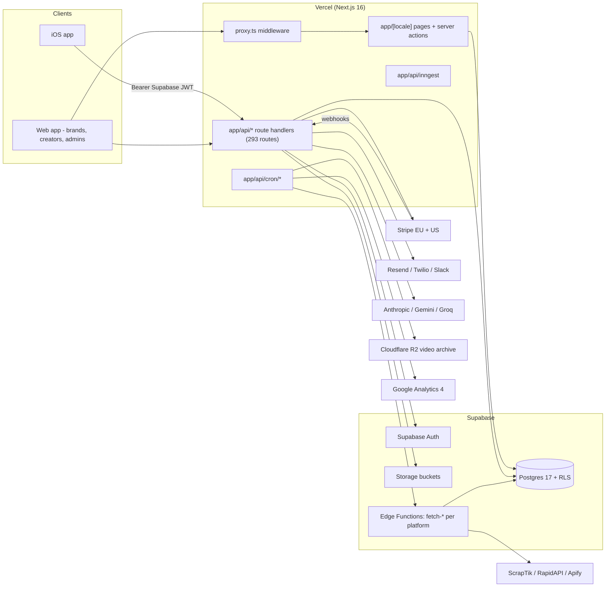
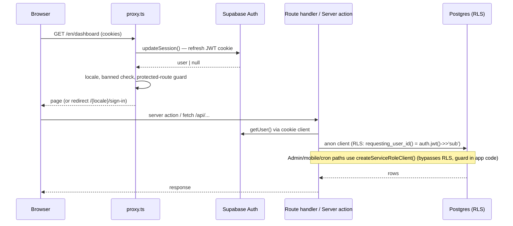

# 8x Platform — Architecture

System-level architecture of the 8x web platform (`@8x/web`). For feature-flow deep dives see the `docs/FLOW_*.md` files; for agent rules and domain invariants see `CLAUDE.md`.

## 1. Overview

8x (8x.social) is a creator-marketing platform. **Brands** post jobs/campaigns; **creators** apply (usually through a brand-specific portal), get accepted, post short-form video on TikTok / Instagram / YouTube, and are paid per post (fixed base pay, bonuses, or CPM-by-views). The platform tracks every published post, syncs engagement metrics from the social platforms, archives the videos, and settles payments through Stripe.

**User roles**

| Role | Backed by | Surface |
|---|---|---|
| Creator | `users` (`account_type = 'creator'`) + `creator_profiles` | Web dashboard + iOS app (`/api/mobile/*`) |
| Brand member | `brand_organizations` + `brand_members` | Web dashboard, brand analytics, wallet |
| Admin (4 sub-roles) | `admin_members.admin_role`: `super_admin` > `senior_account_manager` > `account_manager` > `sales_rep` | `/api/admin/**` (~90+ endpoints), ops pipeline, payouts |

The central domain object is `managed_creators` — the relationship row between a creator and a brand/job (it replaced the deprecated `job_applications` flow). Its lifecycle: `applied` → `test_videos_submitted` → `warming_up` → `active` (→ `ghosted` / `unclear` / `dropped`).



## 2. Tech stack

- **Framework**: Next.js 16 (App Router, Turbopack), React 19, TypeScript 5.8, `pnpm` + `turbo` workspace (`package.json`)
- **UI**: Tailwind CSS 4, shadcn/Radix, TanStack Query/Table, ag-grid (admin), Tiptap, Recharts, Framer Motion
- **i18n**: `next-intl` with locale-prefixed routes (`app/[locale]/`, `i18n/`), smart locale detection in middleware
- **Database**: Supabase Postgres 17 with RLS; local stack via Supabase CLI (`supabase/config.toml`, API :54421, DB :54422)
- **Auth**: Supabase Auth (`@supabase/ssr` cookies on web, raw JWT on mobile). Clerk was the original provider; `user_identities` still maps provider IDs to internal user IDs and legacy users migrate on first sign-in.
- **Payments**: Stripe (dual-region: EU + US accounts) — brand wallets, subscriptions, Stripe Connect creator payouts
- **Background**: Vercel Cron (10 jobs), Inngest (bulk messaging), Supabase Edge Functions (platform scraping), DB webhooks
- **Observability**: Sentry (`sentry.*.config.ts`, source maps prod-only), PostHog EU (proxied via `/ph/*` rewrite in `next.config.ts`), Vercel Analytics
- **AI**: Anthropic SDK (portal-config generation, warm-up screenshot verification), Google Gemini, Groq; OpenAI key present in env
- **Storage**: Supabase Storage (thumbnails, uploads) + Cloudflare R2 via AWS S3 SDK (`lib/storage/r2.ts`) for archived post videos (`https://posts.8x.social`)
- **Testing**: Vitest (unit, colocated `*.test.ts`), Playwright (`tests/e2e/`), translation validation, cron smoke scripts

## 3. Repository layout

```
app/
  [locale]/            # All pages (next-intl locale prefix): dashboard, onboarding, portals, admin
  api/                 # 293 route handlers
    admin/             # Admin ops (~90+ endpoints): jobs, creators, payouts, portal-config AI
    mobile/[...path]/  # Single catch-all for the entire iOS API
    cron/              # 10 Vercel cron jobs
    stripe/            # Checkout + webhook (EU) + webhook-us (US)
    webhooks/          # instagram, tiktok, new-managed-post
    inngest/           # Inngest serve endpoint
    v1/                # Public partner API (brand_api_keys), docs at /documentation
    ...                # creator, brand, jobs, portal, analytics, phone-verification, etc.
proxy.ts               # Next 16 middleware (locale, session refresh, route guards)
lib/
  modules/             # Domain logic: jobs, managed-creators, creator (ledger), portal, cpm,
                       #   warmup, onboarding, ga4, billing, admin, auth, phone-verification...
  supabase/            # Browser/server/middleware Supabase clients (RLS-enforced)
  db/                  # createServiceRoleClient + type aliases (lib/db/types.ts)
  mobile/              # Mobile auth + all mobile handlers (handlers.ts, ~4k lines)
  cron/                # CRON_SECRET auth, run tracker, timeout monitor
  inngest/             # Inngest client + bulk-message function
  storage/             # R2 client, quotas, URL helpers
  notifications/ email/ analytics/ payments/ ...
components/            # React components (Admin/, ui/, ...)
supabase/
  migrations/          # 606 SQL migrations (source of truth for schema)
  functions/           # Edge functions: fetch-{tiktok,instagram,youtube}-*, sync-paid-views
  config.toml          # Local stack config (project_id "viral")
types/supabase.ts      # Generated DB types (pnpm typegen)
i18n/                  # Locales, routing, request config
scripts/ tests/ docs/
```

## 4. Request flow & auth

### Middleware (`proxy.ts`)

Runs on everything except static assets. In order:

1. **API passthrough** — `/api/*`, `/ph/*`, `/.well-known/*`, sitemap/robots skip locale routing.
2. **Auth-domain canonicalization** — `/sign-in`, `/sign-up` redirect to `NEXT_PUBLIC_APP_URL` (app.8x.social) so auth cookies land on the right host (skipped on localhost/preview).
3. **Session refresh** — `updateSession()` (`lib/supabase/middleware.ts`) refreshes the Supabase Auth cookie and yields `user`.
4. **Locale detection** — `NEXT_LOCALE` cookie > `Accept-Language` > IP geolocation > `en`; bots always get `en`. Then `next-intl` routing.
5. **Banned check** — for protected/login routes, looks up `creator_profiles.account_status` (via `user_identities`); `suspended`/`deactivated` → `/banned`.
6. **Route guards** — `/dashboard`, `/onboarding` require a session (redirect to `/sign-in?redirect=...`); authenticated users are bounced off login pages.

### Server-side auth layers

| Concern | Mechanism | Key files |
|---|---|---|
| Web session | Supabase Auth cookies via `@supabase/ssr` | `lib/supabase/server.ts` (publishable key, RLS applies) |
| Identity mapping | `user_identities` (provider, provider_id → internal_user_id); **user IDs are TEXT, not UUID** | `lib/modules/auth/queries.ts`, `lib/auth/get-auth-user-id.ts` |
| Server actions | `validatedActionWithUser` (Zod + user), `withTeam` (brand org) wrappers | `lib/auth/middleware.ts` |
| Admin gate | `verifyAdmin()` checks `users.account_type = 'admin'`; `requireAdminRole(minRole)` ranks against `ADMIN_ROLES_ORDERED`; payout rate limits per role | `lib/modules/admin/api-middleware.ts`, `roles.ts` |
| Admin view-as | `x-admin-view-as-brand` / `x-admin-view-as-creator` headers (read-only, audited); OTP impersonation with Slack alerts | `lib/modules/admin/` |
| Cron | `Bearer CRON_SECRET` with timing-safe compare | `lib/cron/auth.ts` |
| Mobile | Bearer Supabase JWT verified server-side (section 8) | `lib/mobile/auth.ts` |
| Public API | `brand_api_keys` + `brand_api_rate_limit_counters` | `lib/api/v1.ts`, `app/api/v1/` |



## 5. Data layer

- **Migrations**: 606 files in `supabase/migrations/` (from `20250102...` core tables to current). Created only with `supabase migration new`; schema changes end with `NOTIFY pgrst, 'reload schema'`.
- **Generated types**: `pnpm typegen` → `types/supabase.ts` (74 tables/views) → friendly aliases in `lib/db/types.ts`.
- **RLS**: enabled across the schema (60 migration files touch RLS). Because user IDs are TEXT, policies use `(auth.jwt() ->> 'sub')` / `requesting_user_id()`, never `auth.uid()::text`. Service-role clients (admin, mobile, cron) bypass RLS and enforce authorization in application code.
- **RPCs** carry the money/atomicity logic: `record_earning_atomic`, `record_withdrawal_atomic`, `get_creator_balance`, `process_post_payment`, `atomic_wallet_deposit`, `fund_cpm_campaign`, `process_cpm_payout`, etc. (advisory locks for ledger writes).

### Central tables

| Table | Purpose |
|---|---|
| `users` / `user_identities` | Account row (TEXT id, `account_type`, `share_code`); auth-provider → internal ID mapping |
| `creator_profiles` | Creator onboarding state, country, `account_status`, payout config |
| `brand_organizations` / `brand_members` | Brand tenant + membership (the "team") |
| `jobs` | Campaigns: `job_type` (standard/CPM), pay, visibility, JSONB `portal_config` (V2/V3, per-locale) |
| `managed_creators` | Brand↔creator relationship & status pipeline (replaces `job_applications`) |
| `managed_creator_posts` | Per-post payment ledger: `base_pay_cents`, `bonus_cents`, `total_owed_cents`, `payment_status` |
| `posts` + `post_engagement_metrics` | Tracked social posts + time-series metrics from sync pipeline |
| `social_accounts` (+ `tiktok_accounts`, `instagram_accounts`, `youtube_accounts`) | Tracked handles per platform |
| `creator_transactions` | Creator money ledger — single source of truth, balances derived via `get_creator_balance()` |
| `brand_wallet` / `brand_transactions` | Brand balance (1:1 with org) + audit log of deposits/spend |

Supporting tables: `cpm_submissions` (deprecated CPM workspace), `messages`/`admin_message_threads`, `cron_runs`, `sync_jobs`, `push_tokens`, `burner_accounts`, `warmup_*`, `admin_members`, `brand_api_keys`, `subscription_plans`.

## 6. Background jobs & async processing

### Vercel cron (`vercel.json` → `app/api/cron/*`)

All jobs require `Authorization: Bearer CRON_SECRET`; runs are tracked in `cron_runs` (`lib/cron/run-tracker.ts`) with a timeout monitor and stuck-run recovery.

| Path | Schedule (UTC) | Purpose |
|---|---|---|
| `/api/cron/monitor-storage` | `0 0 * * *` | R2/storage usage monitoring |
| `/api/cron/sync-tiktok-periodic` | `0 1 * * *` | TikTok account/post sync |
| `/api/cron/sync-instagram-periodic` | `10 1 * * *` | Instagram sync |
| `/api/cron/sync-youtube-periodic` | `20 1 * * *` | YouTube sync |
| `/api/cron/sync-backfill` | `30 1 * * *` | Post-history backfill for new accounts |
| `/api/cron/sync-cpm-views` | `40 1 * * *` | Refresh CPM submission view counts |
| `/api/cron/backfill-video-storage` | `50 1 * * *` | Download post videos to R2 |
| `/api/cron/detect-stale-posts` | `0 2 * * *` | Flag posts that stopped updating |
| `/api/cron/backfill-managed-ig-yt-video` | `0 3 * * *` | IG/YT video backfill for managed creators |
| `/api/cron/sync-ga4` | `0 6 * * *` | GA4 data sync for connected brands |

Most cron/AI routes get `maxDuration: 300` via the `functions` block in `vercel.json`.

### Sync pipeline

Cron routes batch accounts → invoke **Supabase Edge Functions** (`supabase/functions/`): `fetch-accounts-and-35-posts`, `fetch-tiktok-post-data`, `fetch-instagram-post-data` / `fetch-instagram-account-reels`, `fetch-youtube-short-data` / `fetch-youtube-account-shorts`, `sync-paid-views`. These call third-party scraping APIs (ScrapTik for TikTok — feature-flagged in PostHog; RapidAPI for IG/YT; Apify), write `posts` + `post_engagement_metrics`, and a DB trigger auto-creates `managed_creator_posts` rows. Slack notifications fire for new posts needing review.

### Inngest

Minimal footprint: client `lib/inngest/client.ts` (`id: '8x'`), served at `app/api/inngest/route.ts`, one function — `bulkMessageFunction` (`lib/inngest/bulk-message.ts`) for fan-out admin bulk messaging. Keys: `INNGEST_EVENT_KEY` / `INNGEST_SIGNING_KEY`.

### Webhooks (inbound)

- **Stripe** — `app/api/stripe/webhook/` (EU account) and `webhook-us/` (US account): `checkout.session.completed` (wallet deposits, subscriptions), `account.updated` (Connect onboarding), `transfer.created` (mark earnings completed), `payout.*`, `customer.subscription.*`, `invoice.*`.
- **`/api/webhooks/new-managed-post`** — Slack alert on new managed post (CRON_SECRET-protected, triggered by DB webhook).
- **`/api/webhooks/instagram`**, **`/api/webhooks/tiktok`** — platform developer-app callbacks/verification.
- **`/api/hooks/generate-ai-feedback`** — long-running AI feedback hook (maxDuration 300).

## 7. External integrations

| Integration | Use | Where |
|---|---|---|
| **Stripe (EU + US)** | Brand wallet deposits (Checkout), brand subscriptions, creator payouts via Stripe Connect transfers + bank payouts; off-platform methods (PayPal/Venmo/SideShift) recorded in ledger | `app/api/stripe/*`, `lib/payments/`, `lib/modules/billing/` |
| **ScrapTik / RapidAPI / Apify** | Post + account scraping for TikTok/IG/YT | `supabase/functions/*`, `RAPIDAPI_KEY_*`, `APIFY_API_TOKEN` |
| **TikTok & Instagram OAuth** | Creator account connection (`creator_tiktok_connections`, `creator_instagram_connections`) | `lib/modules/tiktok/`, `lib/modules/instagram-oauth/`, `TIKTOK_CLIENT_*`, `INSTAGRAM_APP_*` |
| **YouTube Data API** | Account/shorts lookups | `YOUTUBE_API_KEY` |
| **GA4** | Brand website-analytics sync (daily cron) | `lib/modules/ga4/` |
| **Resend** | Transactional email (prod: `notify.8x.social`); Mailpit SMTP locally | `lib/email/` |
| **Twilio Verify** | Phone verification (OTP SMS) during onboarding | `lib/modules/phone-verification/twilio.ts` |
| **Slack** | Admin channel alerts (bot token) + brand-configured incoming webhooks; plain-text messages only | `lib/notifications/slack/` |
| **Anthropic / Gemini / Groq** | Portal-config generation & AI edit (`/api/admin/jobs/*/ai-edit-portal-config`), warm-up screenshot verification (`lib/modules/warmup/verify-screenshot.ts`), bot LLM (`lib/bot/llm.ts`) | `ANTHROPIC_API_KEY`, `GEMINI_API_KEY`, `GROQ_API_KEY` |
| **Cloudflare R2** | Permanent video archive (`tiktok/{username}/{post_id}.mp4`) served from `posts.8x.social` | `lib/storage/r2.ts` |
| **PostHog (EU) / Sentry / Vercel Analytics** | Product analytics (proxied at `/ph/*`), error tracking, web analytics | `instrumentation*.ts`, `sentry.*.config.ts` |

## 8. Mobile API (iOS client)

The entire iOS surface is **one catch-all route**: `app/api/mobile/[...path]/route.ts` (`maxDuration: 40`), dispatching to ~70 handlers in `lib/mobile/handlers.ts` (jobs feed, apply/applications, profile, wallet/Stripe Connect, push tokens, notifications, inbox/threads, posts & ad codes, tasks, warm-up timeline & screenshots, burner accounts, contracts, version check, account deletion).

**Auth** (`lib/mobile/auth.ts`):
1. iOS signs in directly against Supabase Auth (email OTP) and sends `Authorization: Bearer <Supabase JWT>` on every request.
2. `getMobileUser()` verifies the token server-side via `supabase.auth.getUser(token)` using the **service-role client**, then loads the `users` row.
3. First-time mobile users are **auto-provisioned**: a `users` row (`account_type: 'creator'`, generated `share_code`) plus a `user_identities` mapping so `requesting_user_id()` resolves in RLS.
4. **Apple review bypass** (`lib/mobile/auth-test-bypass.ts`): a fixed (email, code) pair exchanges for a real session, gated by `creator_profiles.is_test_account = true` and `APPLE_REVIEW_BYPASS_ENABLED`.

CORS is restricted to known origins (app.8x.social, Expo dev ports); native requests with no `Origin` header pass with `*`. `/.well-known/` is excluded from locale routing in `proxy.ts` because iOS needs `apple-app-site-association` at the root without redirects. Push notifications use the `push_tokens` table (see `docs/MOBILE_PUSH.md`).

## 9. Deployment & environments

**Vercel** hosts the Next.js app. `vercel.json` also defines: redirect of apex `8x.social` → `www.8x.social`, security headers (CSP, HSTS, X-Frame-Options DENY, etc.), cron schedules, and per-route `maxDuration`.

**Branch/release flow** (`docs/DEPLOYMENT.md`): auto-deploy of `main` is disabled in `vercel.json` (`git.deploymentEnabled.main: false`) — CI pushes `main` to **staging** (`app-staging.8x.social`, runs migrations + edge-function deploys), and a `v*` git tag updates the CI-managed `production` branch which deploys **production** (`app.8x.social`). Each environment has its own Supabase project (`*_STAGING` / `*_PRODUCTION` env vars); local dev runs the Supabase CLI stack (`supabase/config.toml`, container `supabase_db_viral`).

**Environment variables** (names from `.env.example` — values never committed):

- **Supabase**: `NEXT_PUBLIC_SUPABASE_URL`, `NEXT_PUBLIC_SUPABASE_PUBLISHABLE_KEY`, `SUPABASE_SECRET_KEY`, `SUPABASE_SERVICE_ROLE_KEY` (+ `_STAGING` / `_PRODUCTION` variants)
- **Stripe**: `STRIPE_SECRET_KEY` / `STRIPE_WEBHOOK_SECRET` / `STRIPE_PUBLISHABLE_KEY` and `_US` variants
- **Scraping/social**: `RAPIDAPI_KEY{,_TIKTOK,_YOUTUBE,_INSTAGRAM}`, `APIFY_API_TOKEN`, `TIKTOK_CLIENT_KEY/SECRET/REDIRECT_URI`, `INSTAGRAM_APP_ID/SECRET/REDIRECT_URI`, `YOUTUBE_API_KEY`
- **AI**: `ANTHROPIC_API_KEY`, `GEMINI_API_KEY`, `GROQ_API_KEY`, `OPENAI_API_KEY`, `GOOGLE_TRANSLATE_API_KEY`
- **Messaging**: `RESEND_API_KEY`, `SMTP_HOST/PORT` (Mailpit), `TWILIO_ACCOUNT_SID/AUTH_TOKEN/VERIFY_SERVICE_SID/PHONE_NUMBER`, `SLACK_BOT_TOKEN`, `SLACK_CHANNEL_ID_*`, `SLACK_ALERTS_WEBHOOK_URL`
- **Infra/jobs**: `CRON_SECRET`, `INNGEST_EVENT_KEY/SIGNING_KEY/DEV`, `R2_ACCOUNT_ID/ACCESS_KEY_ID/SECRET_ACCESS_KEY/BUCKET_NAME/PUBLIC_URL` (used by `lib/storage/r2.ts`), `BOT_INTERNAL_SECRET`, `VERCEL_AUTOMATION_BYPASS_SECRET`, `APPLE_REVIEW_BYPASS_ENABLED`
- **Analytics/URLs**: `NEXT_PUBLIC_POSTHOG_*`, `POSTHOG_*`, `NEXT_PUBLIC_APP_URL`, `NEXT_PUBLIC_BASE_URL`, `NEXT_PUBLIC_SITE_URL`, `NEXT_PUBLIC_MARKETING_URL`, `NEXT_PUBLIC_STORAGE_CDN_URL`, `NEXT_PUBLIC_APP_ENV`
